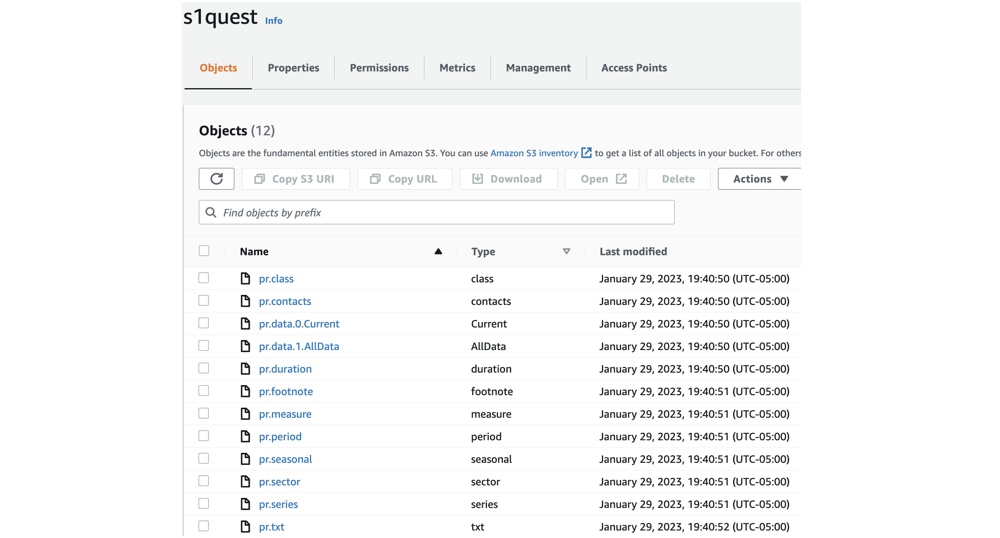

# Rearc-Quest

The quest is divided into 4 parts:

- [Rearc-Quest](#rearc-quest)
  - [Part 1 - AWS S3 \& Sourcing Datasets](#part-1---aws-s3--sourcing-datasets)
    - [AWS Setup](#aws-setup)
    - [Execution](#execution)
    - [AWS Glue - Job Schedule](#aws-glue---job-schedule)
    - [GIT - CI/CD](#git---cicd)
  - [Part 2 - APIs](#part-2---apis)
  - [Part 3 - Data Analytics](#part-3---data-analytics)
  - [Part 4 - Infrastructure as Code \& Data Pipeline](#part-4---infrastructure-as-code--data-pipeline)
    - [Flow](#flow)

## Part 1 - AWS S3 & Sourcing Datasets

This [dataset](https://download.bls.gov/pub/time.series/pr/) was uploaded to the S3 Bucket using [s3_script.py](https://github.com/shaswat-dharaiya/Rearc-Quest/blob/main/s3_script/s3_script.py).

> **Note:** [s3_script.py](https://github.com/shaswat-dharaiya/Rearc-Quest/blob/main/s3_script/s3_script.py) (Runs on AWS Glue) is different from [s3_script.ipynb](https://github.com/shaswat-dharaiya/Rearc-Quest/blob/main/s3_script/s3_script.ipynb) (Runs locally)



### AWS Setup

1. Run locally:

   <!-- To ease up the process, directly a root user has been created  -->

   Create an Access key (required to run the script locally) for your IAM User.

   Add the following policies to your IAM User:
    1. AmazonS3FullAccess
    2. AWSGlueConsoleFullAccess

2. Run on AWS Glue:

    Create a new role `s3_glue_quest`:
    * Add Use case as `Glue` and click next.
    * Add following Permissions policies:
        1. AmazonS3FullAccess
        2. CloudWatchFullAccess
        3. AWSGlueConsoleFullAccess


### Execution

```python
key = "../srd22_accessKeys.csv" if environ.get('LH_FLAG') else None
bucket_name = "s1quest"
res_url = "https://download.bls.gov/pub/time.series/pr/"

s = ManageS3(bucket_name, res_url, key)
s.sync_files()
```

### AWS Glue - Job Schedule
Once we have the script running locally, we can upload it to `AWS Glue`. And schedule a job.

In Glue Studio, select `Python Shell script editor` and select `Upload and edit an existing script` and click `Create`.

Attach your IAM Role to your job.


Test run the job by clicking `Run`.


Go to `Schedules` Tab and click `Create Schedule`, type in name and select the frequency. This will keep the S3 bucket in sync with the dataset.


### GIT - CI/CD

The python script in Glue comes from `s3_script.py` file in an S3 bucket. Our aim is to automatically update that file upon `git push` done on the script.

We ceate a SyncS3 `github actions` defined in [syncS3.yml](https://github.com/shaswat-dharaiya/Rearc-Quest/blob/main/.github/workflows/syncS3.yml) to achieve this.

It will use AWS Credentials and copy the contents of the `s3_script` folder to `script` folder in the S3:

Upon a `git push` it runs the SyncS3 job.


## Part 2 - APIs

Using the [s3_script.py](https://github.com/shaswat-dharaiya/Rearc-Quest/blob/main/s3_script/s3_script.py)'s `new_s3_add_files()` method data from the [api](https://datausa.io/api/data?drilldowns=Nation&measures=Population) is uploaded to the S3 Bucket on AWS.

```python
new_bucket = "s2quest"
api = "https://datausa.io/api/data?drilldowns=Nation&measures=Population"
file_key = "data.json"
s.new_s3_add_files(new_bucket, api, file_key)
```


## Part 3 - Data Analytics
Implementation and output of this part is available in [s2quest.ipynb](https://github.com/shaswat-dharaiya/Rearc-Quest/blob/main/s2quest.ipynb).

This part is divided into 3 Steps:
1. Step 3.0 - Data Collection - Data from API & S3 (pr.data.0.Current)
2. Step 3.1 - Mean & Standard Deviation
   * Mean&nbsp;&nbsp;&nbsp;&nbsp;&nbsp;&nbsp;&nbsp;&nbsp;&nbsp;&nbsp;&nbsp;&nbsp;&nbsp;&nbsp;&nbsp;&nbsp;&nbsp;&nbsp;&nbsp;&nbsp;&nbsp;&nbsp;&nbsp; = 317437383.0
   * Standard Deviation = 4257090.0
3. Step 3.2 - Grouping
4. Step 3.3 - Filtering

## Part 4 - Infrastructure as Code & Data Pipeline

For this we use `Terraform` & `Github Actions` to achieve Automation of Data Pipeline.

The idea is to achieve complete automation of the above steps. One change made, is use of `AWS Lambda` instead of `AWS Glue` as the former is what's asked and latter is more of an overkill in our case.

### Flow

Once development is done, upon a successful `git push` the entire infrastructure gets implemented "on it's own".

List of things that execute before infrastructure setup:
1. Using the root user credentials, a new IAM user gets created.
2. Policies attached to that user can be see in this file.
3. The User creates 2 new buckets 1 for the dataset and 1 for the API.
   * The bucket with the API data will also contain code for the lambda functions (uploaded later on).
4. A virtual environment gets configured on github's server using the LambdaS3 action.
   * the virtual environment contains following requirements: [requests, beautifulsoup4, lxml, pandas, boto3]
5. Main files - `classes/ManageS3.py`, `lambda/s3_script.py` & `lambda/s2quest.py` gets copied to the `$VIRTUAL_ENV/lib/python3.9/site-packages/`
   * The entire folder gets zipped and upload to S3 bucket, and all the files along with the zip files are deleted.
6. Terraform comes into picture and the executes [TF_Script.sh](https://github.com/shaswat-dharaiya/Rearc-Quest/blob/main/pipeline/TF_Script.sh).
   * This script is reponsible for init plan and apply of the entie infrastructure.


List of things execute during/for infrastructure setup: