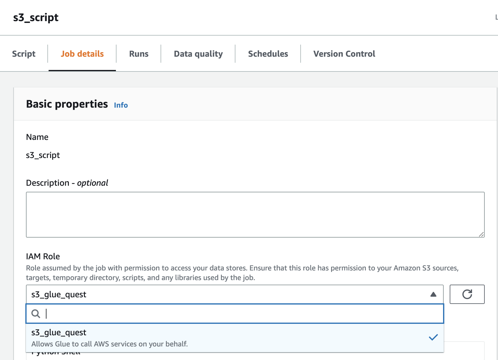
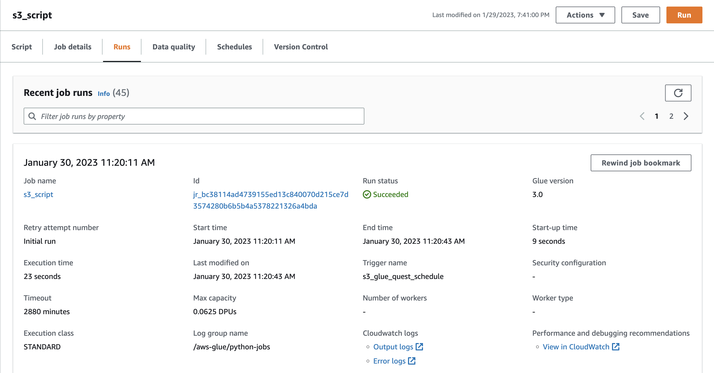

# Rearc-Quest

The quest is divided into 4 parts:

1. [AWS S3 & Sourcing Datasets](#part-1---aws-s3--sourcing-datasets)
2. [APIs](#part-2---apis)
3. [Data Analytics](#part-3---data-analytics)
4. Infrastructure as Code & Data Pipeline with AWS CDK

## Part 1 - AWS S3 & Sourcing Datasets

This [dataset](https://download.bls.gov/pub/time.series/pr/) was uploaded to the S3 Bucket using [s3_script.py](https://github.com/shaswat-dharaiya/Rearc-Quest/blob/main/s3_script/s3_script.py).

> **Note:** [s3_script.py](https://github.com/shaswat-dharaiya/Rearc-Quest/blob/main/s3_script/s3_script.py) (Runs on AWS Glue) is different from [s3_script.ipynb](https://github.com/shaswat-dharaiya/Rearc-Quest/blob/main/s3_script/s3_script.ipynb) (Runs locally)


### AWS Setup

1. Run locally:

    Create an Access key (required to run the script locally) for your IAM User.

    Add the following policies to your IAM User:
    1. AmazonS3FullAccess
    2. AWSGlueConsoleFullAccess

2. Run on AWS Glue:

    Create a new role `s3_glue_quest`:
    * Add Use case as `Glue` and click next.
    * Add following Permissions policies:
        1. AmazonS3FullAccess
        2. CloudWatchFullAccess
        3. AWSGlueConsoleFullAccess


### Code walk-through - [s3_script.py](https://github.com/shaswat-dharaiya/Rearc-Quest/blob/main/s3_script/s3_script.py)

Class `manage_s3` has a <u>constructor</u> and <u>4 methods</u>.

1. The constructor has 3 params: `bucket_name` , `url`, and `key=None`
   * bucket_name: Name of the S3 bucket
   * url: URL to the dataset
   * key: Path to Access key & Secret. Default is `None` as key is not required on AWS.

2. Method `get_name()` gets the name of files in dataset:
   * Uses `BeautifulSoup` to scrap the file names.
  
3. Method `read_s3()` reads the file and its contents from the s3 bucket.
   * Uses `create_bucket` method which is indempotent, meaning it will create the bucket if bucket doesn't exist, else will simply return the existing bucket.

4. Method `sync_files()` will use the above two methods and will sync S3 bucket to the dataset.
   * Calls `get_name()` & `read_s3()`
   * Syncing:
     1. File not in S3 - upload it from dataset to S3.
     2. File contents in S3 different from dataset - replace the file in S3 with the file from dataset.
     3. File in S3 but not in dataset - delete the file from S3.

5. Method `new_s3_add_file())` is explained in [Step 2](#part-2---apis).

### Execution

```
key = "srd22_accessKeys.csv"
bucket_name = "s1quest"
res_url = "https://download.bls.gov/pub/time.series/pr/"

s = manage_s3(bucket_name, res_url, key)
s.sync_files()
```

### AWS Glue - Job Schedule
Once we have the script running locally, we can upload it to `AWS Glue`. And schedule a job.

In Glue Studio, select `Python Shell script editor` and select `Upload and edit an existing script` and click `Create`.

Attach your IAM Role to your job.



Test run the job by clicking `Run`.



Go to `Schedules` Tab and click `Create Schedule`, type in name and select the frequency. This will keep the S3 bucket in sync with the dataset.


### GIT - CI/CD

The python script in Glue comes from `s3_script.py` file in an S3 bucket. Our aim is to automatically update that file upon `git push` done on the script.

We use `github actions` to achieve this, where we mention that 
```
name: SyncToS3
on:
  push:
    path: ./s3_script/s3_script.py
```

And it will use AWS Credentials and copy the contents of the `s3_script` folder to `script` folder in the S3:

```
jobs:
  build:
    runs-on: ubuntu-latest
    steps:
      - uses: actions/checkout@master
      - name: SyncS3
        run: |
          chmod +x ./sync_s3.sh
          ./sync_s3.sh
        env:
          AWS_S3_BUCKET: ${{ secrets.AWS_S3_BUCKET }}
          AWS_ACCESS_KEY_ID: ${{ secrets.AWS_ACCESS_KEY_ID }}
          AWS_SECRET_ACCESS_KEY: ${{ secrets.AWS_SECRET_ACCESS_KEY }}
          SOURCE_DIR: './s3_script'
          DEST_DIR: 'scripts/'
```


`SyncToS3` action uses a shell script - `sync_s3.sh` to achieve the automation:

* Configuration:
```
AWS_REGION="us-east-1"

# configure aa profile and save the credentials to that profile.
# >> /dev/null redirects standard output (stdout) to /dev/null, which discards it.
# 2>&1 redirects standard error (2) to standard output (1),
# which then discards it as well since standard output has already been redirected.
# & indicates a file descriptor.
# There are usually 3 file descriptors - standard input, output, and error.
aws configure --profile rearc-quest-aws <<-EOF > /dev/null 2>&1
${AWS_ACCESS_KEY_ID}
${AWS_SECRET_ACCESS_KEY}
${AWS_REGION}
text
EOF
```
* Collection:
```
# Use the profile to connect to the s3 bucket
sh -c "aws s3 sync ${SOURCE_DIR:-.} s3://${AWS_S3_BUCKET}/${DEST_DIR} \
              --profile rearc-quest-aws \
              --no-progress \
              --endpoint-url $*"
```

* Exit:
```
# Unset the variables.
# The EOF delimeter tells the shell that the here document has completed
aws configure --profile rearc-quest-aws <<-EOF > /dev/null 2>&1
null
null
null
text
EOF
```


## Part 2 - APIs


### Execution

We use the method `new_s3_add_files` of previously used class `manage_s3`.
* Takes in 3 params: `bucket_name`, `api`, & `key`:
   * bucket_name: Name of the S3 bucket
   * api: URL to the api
   * key: Name of the file to store in S3.
* Uses `create_bucket` method which is indempotent, meaning it will create the bucket if bucket doesn't exist, else will simply return the existing bucket.

> **Note:** `new_s3_add_files` is part of [s3_script.ipynb](https://github.com/shaswat-dharaiya/Rearc-Quest/blob/main/s3_script/s3_script.ipynb) and is not included in [s3_script.py](https://github.com/shaswat-dharaiya/Rearc-Quest/blob/main/s3_script/s3_script.py)
```
new_bucket = "s2quest"
api = "https://datausa.io/api/data?drilldowns=Nation&measures=Population"
file_key = "data.json"
s.new_s3_add_files(new_bucket, api, file_key)
```

## Part 3 - Data Analytics
Implementation of this part is available in [s2Quest.ipynb](https://github.com/shaswat-dharaiya/Rearc-Quest/blob/main/s2Quest.ipynb).

This part is divided into 3 Steps:
1. Step 3.0 - Data Collection - Data from API & S3 (pr.data.0.Current)
   * Get the data from this [API](https://datausa.io/api/data?drilldowns=Nation&measures=Population) and file - "pr.data.0.Current" from S3 and store it in `Pandas Dataframe`.
   * Apply `pd.to_numeric` to both the dataset in order to parse the numeric text.
   * Data from S3 is of tsv format and we split the rows using `\t`.
2. Step 3.1 - Mean & Standard Deviation
   * Select the data from the API for the following condition: Year $\in$ `[2013,2018]`
   * Use `describe()` method of `pandas.DataFrame` class and restructure to get the desired output, ie. mean & standard deviation of the population.
3. Step 3.2 - Grouping
   * Perform groupby on `series_id` & `year` and sum the values up.
   * Now get the index of max value for 1st index group, ie. series_id by mentioning `level=0` in groupby statement.
4. Step 3.3 - Filtering
   * Select data for **PRS30006032** and **Q01**.
   * Perform merge between above filtered data and the data from the API on `year` column.